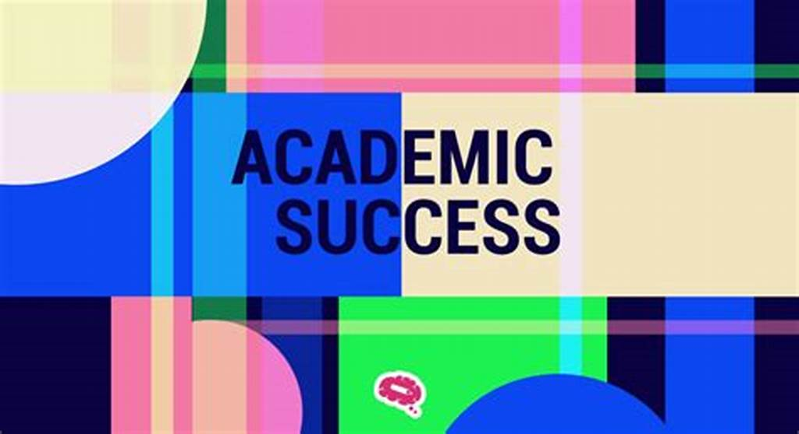
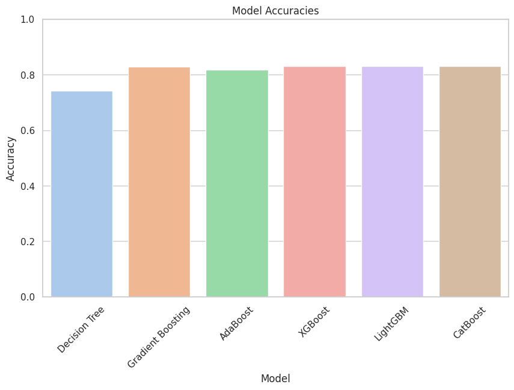
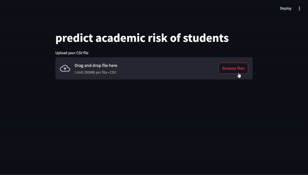

# Academic Success Prediction Streamlit App



Predicting academic success in students is a complex task, influenced by a variety of factors ranging from personal attributes to educational environments. This Kaggle competition challenges you to build a model that can predict academic risk in higher education, using various features that capture student demographics, academic history, and more.

With numerous features describing the diverse aspects of student data, this competition provides an opportunity to showcase your data science skills and improve educational outcomes through predictive modeling. [Kaggle competition](https://www.kaggle.com/competitions/playground-series-s4e6/overview)

## Table of Contents
* [Dataset Overview](#dataset-overview)
* [Notebook Contents](#notebook-contents)
* [Requirements](#requirements)
* [Usage](#usage)
* [Streamlit app](#streamlit-app)

## [Dataset Overview](https://www.kaggle.com/competitions/playground-series-s4e6/data)
- train.csv - the training set containing student data and target labels for academic success.
- test.csv - the test set to evaluate model performance.
- sample_submission.csv - a benchmark submission to help you get started.

## Notebook Contents
The Jupyter Notebook included in this repository covers the following steps:

1. **Basic Data Exploaration**: 
    - Preprocessing the dataset to handle missing values, encode categorical variables, and remove duplicate entries.
    - Exploratory analysis to understand the structure and distribution of the data

2. **Exploratory Data Analysis (EDA)**: 
    - Generating insights into the relationships between different features and the target variable through statistical analysis and visualization.
    - Key techniques include correlation matrices, scatter plots, distribution plots, and more advanced visualizations.

3. **Basic Data Engineering** : 
    - Creating pipelines for both training and test sets to streamline data processing.
    - Normalizing data and handling categorical variables appropriately.
    - Defining input features and the target variable, followed by splitting the data for model training and evaluation.

4. **Model Fitting and Parameter Tuning**:

    - Baseline Models:
        - Decision Tree: For handling complex interactions.
    - Advanced Models:
        - Gradient Boosting Regression: For boosting model performance iteratively.
        - LightGBM & XGBoost: For scalable and efficient gradient boosting.
        - Stacking Average Models: For ensemble learning by combining predictions from multiple models.
        - TensorFlow DEEP NET: For leveraging deep learning capabilities on structured data.

5. **EVALUATION**:
    - Performance metrics and cross-validation techniques used to assess model accuracy.
    - Final model selection and evaluation on the test set.
## Requirements
To run the notebook, you need the following dependencies installed:

`pandas`
`numpy`
`scipy`
`matplotlib`
`seaborn`
`scikit-learn`
`tensorflow`
`lightgbm`
`xgboost`
`joblib`
`streamlit`

## Usage
1. Clone this repository to your local machine using the following command:
```bash
git clone https://github.com/Xmen3em/Kaggle-Competitions
```
2. Navigate to the project directory:
```bash
cd Classification with an Academic Success Dataset
```
3. Install the required dependencies 
```bash
pip install -r requirements.txt
```
4. Run the Jupyter Notebook to explore the data and build the model:
```bash
jupyter notebook
```
5. For deployment, you can run the Streamlit app:
```bash
streamlit run Streamlit.py
```

## Streamlit app
Here is a video demonstration of the Streamlit app in action:



