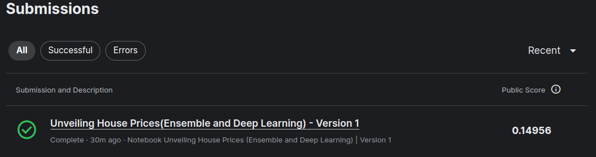

# House Prices - Advanced Regression Techniques

Ask a home buyer to describe their dream house, and they probably won't begin with the height of the basement ceiling or the proximity to an east-west railroad. But this playground competition's dataset proves that much more influences price negotiations than the number of bedrooms or a white-picket fence.

With 79 explanatory variables describing (almost) every aspect of residential homes in Ames, Iowa, this competition challenges you to predict the final price of each home. [Kaggle competition](https://www.kaggle.com/competitions/house-prices-advanced-regression-techniques)

## Table of Contents
* [Dataset Overview](#dataset-overview)
* [Notebook Contents](#notebook-contents)
* [Requirements](#requirements)
* [Usage](#usage)
* [Screenshots](#screenshots)

## [Dataset Overview](https://www.kaggle.com/competitions/house-prices-advanced-regression-techniques/data#:~:text=Submissions-,Dataset%20Description,-File%20descriptions)
- train.csv - the training set
- test.csv - the test set
- data_description.txt - full description of each column, originally prepared by Dean De Cock but lightly edited to match the column  names used here
- sample_submission.csv - a benchmark submission from a linear regression on year and month of sale, lot square footage, and number of bedrooms [Dataset]

## Notebook Contents
The Jupyter Notebook included in this repository covers the following steps:

1. **Basic Data Exploaration**: The dataset is preprocessed to handle missing values, encode categorical variables, and remove duplicate values.
2. **Exploratory Data Analysis (EDA)**: Various visualizations and statistical analyses are performed to gain insights into the distribution and relationships among different features in the dataset.
    - Data correlation
    - plots between target and independent variables
    - Distribution of the numerical variables
    - explore dependent variable
    - and various advanced visualizations
3. **Basic Data Engineering** : Creating a pipeline for tain and test sets
    - define inputs and target of the data
    - normalize data 
    - handle categorical variables
    - split data for ML Models
4. **Model Fitting and Parameter Tuning**:
    - Linear Regression, Random Forest: Utilized for baseline modeling and capturing linear relationships and complex interactions in the data.
    - Gradient Boosting Regression: Employed for ensemble learning to enhance predictive performance through iterative refinement.
    - Light GBM: Leveraged for its efficiency and ability to handle large datasets with faster training speed.
    - XGBoost: Employed for its scalability and performance optimization in gradient boosting frameworks.
    - Lasso Regression, Elastic Net Regression: Applied for feature selection and regularization to prevent overfitting.
    - Stacking Average Models: Utilized for ensemble learning, combining predictions from multiple models to improve accuracy.
    - TensorFlow Decision Forests: Employed for its versatility and ability to handle structured data efficiently, providing robust predictions.

## Requirements
you need the following dependencies installed:
* pandas
* numpy
* scipy
* matplotlib
* seaborn
* scikit-learn
* TensorFlow/Keras

## Usage
1. Clone this repository to your local machine.
2. Install the required dependencies.

## Screenshots
This is the score of the House Prices Prediction on Kaggle:

